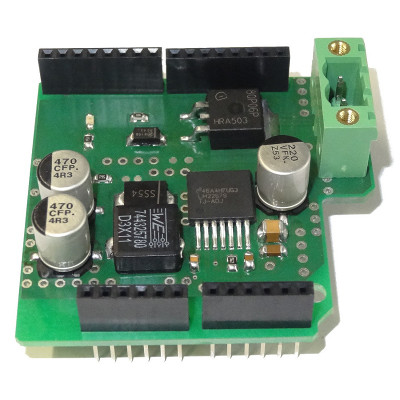

💾 Power Shield
===============

# 📸 Image

# 📂 Description

The LXRobotics Power Shield facilitates the high power supply of an Arduino Board over a wide input voltage range. Furthermore, the Power Shield allows the usage of Shields with high power requirements, which can not be supplied solely by the linear regulator of the Arduino (such as the Servo Shield when connecting 18 servos). A reverse polarity protection protects the Power Shield against destruction caused by faulty connections of the input voltage.

**Features**

* High power supply over wide input voltage rande 6 - 24 V DC
* Allows usage of Shields with high power requirements ()
* Reverse polarity protection
* Status-LED
* High-quality pluggable screw terminals for easy and stable connection of the supply
